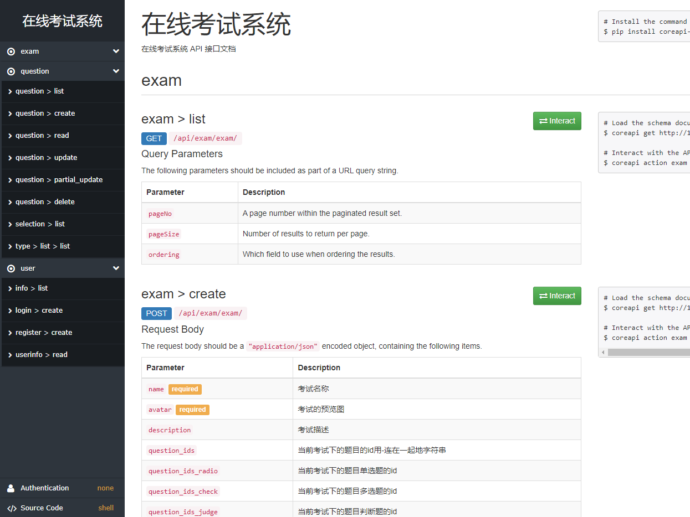

# python-django-online-exam
本项目 fork 自 [spring-boot-online-exam](https://github.com/19920625lsg/spring-boot-online-exam) 项目，原项目使用 springboot + vue实现，我将后端改为 django-drf，为方便学习 Python 的朋友提供一个示例，主要适配后端，前端对接口做了一些修改。

> 在线Demo预览，http://129.211.88.191 ，账户分别是admin、teacher、student，密码是admin123，这是原作者提供的在线Demo

### 介绍
基于 DjangoRestFrameWork 的在线考试系统

### 功能简介

+ 支持单选题、多选题、判断题
+ 支持学生(student)、教师(teacher)、管理员(admin)三种角色
  + 学生：参加考试和查看我的考试
  + 教师：学生的所有权限+创建/编辑题目+创建/编辑考试
  + 管理员：教师的所有权限+管理用户

### 软件架构

> 前后端分离，前段组件化，方便二次开发；后端

+ 后端采用DjangoRestFrameWork+CoreApi+JWT校验,根据不同用户的权限返回给用户不同的数据
+ 前端采用Vue+AntDesign,组件化拆分，封装了很多年公共组件，方便维护和二次开发

### 使用教程

+ 1.下载代码
  ```shell
  git clone git@github.com:xingxingzaixian/python-django-online-exam.git
  ```
+ 2.初始化环境
  
  > 安装mysql的步骤这里省略，网上的教程很多。安装好mysql后，执行 doc/sql/exam.sql 文件导入数据库信息。
  > 使用 Pip 安装 Pipenv 包
  
+ 3.启动后端
  
  > 进入 backend\exam 目录下，执行 `Pipenv install`，注意我用的是 python3.8，如果你用的是其他版本，请将 Pipfile 文件中的版本号改一下
  > 执行完上面的安装命令后，再执行 `Pipenv run dev`，就启动了后端，在浏览器端访问 http://localhost:9527/docs 即可看到后端的 API 界面

  

+ 4.启动前端
  + 进入到前端代码路径 `cd frontend/exam/`
  + 安装依赖 `yarn install`
  + 启动前端 `yarn run serve`
+ 5.部署完毕，查看效果
  
  > 打开 http://localhost:8000 或者 http://本机ip:8000 即可查看演示效果

### 功能图示

+ 1.管理题目
  + 1.1 题目列表
    
    > 
  + 1.2 题目创建
    
    > 
  + 1.3 题目更新
    
    > 
+ 2.考试管理
  + 2.1 考试列表
    
    > 
  + 2.2 考试创建
    
    > 
  + 2.3 考试更新(`还有点小bug，开发中`)
    
    > 
+ 3.我的考试
  + 3.1 参加考试
    > 在"考试列表"模块点击自己想参加的考试卡片即可
    > 
    > 
  + 3.2 考试记录查看
    
    > 
